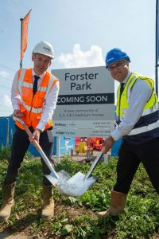

A Stevenage development will deliver 800 homes, alongside a local centre, a primary school, country park and public open space.

It will come from Bellway North London and Miller Homes, while work has already started on the first phase of new homes, for which detailed planning consent was granted by Stevenage Borough Council earlier this year.

Bellway is to build 400 homes overall – with 105 homes on the first phase, featuring 75 two, three and four-bedroom properties for private sale and 30 affordable homes available for local people through low-cost rent or shared ownership.

Miller Homes is delivering 396 new homes at Forster Park, including 43 for private sale and 41 affordable homes on the first phase. The North Road development will feature a range of energy efficient two to five-bedroom homes and is anticipated to launch later this year.

Ali Maruf, managing director of Bellway North London, said: “A significant milestone for Bellway, the ground-breaking at Forster Park celebrates our joint project with Miller Homes which has local community, heritage and sustainability at its core.

“To mark the start of construction, we gathered together on the land near Rooks Nest House, where the renowned English writer EM Forster grew up, and which inspired his novel Howard’s End. This is truly a beautiful part of the world, and we have named our development Forster Park in his honour.

“We are committed to an overarching focus on sustainability, which complements the site’s natural surroundings, as well as Bellway’s ethos. Existing trees and shrubs will be retained wherever possible, alongside the addition of generous new planting. Green open spaces and ponds will be thoughtfully designed and implemented to help support local wildlife, as well as bird and bat boxes being installed.

“This first phase will see us not only deliver new homes – which will all have electric vehicle charging points – but also a new local centre with commercial space which could be used to house a convenience store.”

Detailed applications for a further 115 homes within phase one and the 93-acre country park are to be considered by the council at a later date.

Maruf added: “With regard to the wider scheme, we are proud to be teaming up with Miller Homes to create a brand-new neighbourhood that will bring huge investment to improve local infrastructure and services.”

Gavin Jones, regional operations director at Miller Homes South Midlands, said: “We are excited to announce that our work has now begun on Miller Homes’ new Stevenage development, Forster Park.

“Energy efficiency and environmental considerations are at the forefront of these designs; EV charging points will ensure homes are futureproofed for the new community we are creating at Forster Park, while boxes for birds and bats will encourage wildlife to thrive in green open spaces.

“Together, we will also be making contributions of over £1.1 million to the local community, including support for healthcare, schools, transport and infrastructure, and sports facilities.

“The development is conveniently situated in an excellent location for commuters, with easy access to the A1M and Stevenage town centre for the train station for easy connections to London.”

Both Bellway and Miller Homes expect to officially launch later on this year, with show homes to follow in spring 2024.